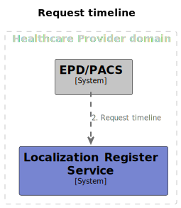

# Interface Specifications Localization Register Service

## Disclaimer

The GFModules project is currently under development. The information in this interface description is
subject to change.

## Context

The GFModules project is a collection of applications that have the purpose of improving
data exchange between healthcare providers. This project is the technical implementation of
various components of the 'Generieke Functies, lokalisatie en addressering' project from the
Ministry of Health, Welfare and Sport of the Dutch government.

## Summary

This interface enables healthcare providers to fetch patient's medical timeline. The timeline in this context is a representation of patient's medical history.



## Process

This interface is used in the following process:

- [timeline](https://github.com/minvws/gfmodules-coordination-private/blob/main/docs/processes/timeline.md)

## Endpoint

The interface provides the following endpoint:

- timeline

## timeline

The timeline endpoint gets information about about patient medical history by using two parameters, pseudonym and data_domain. The response is an [FHIR R4 Bundle](https://www.hl7.org/fhir/r4/bundle.html) of type `searchset`.

|  |                                                     |
|---|-----------------------------------------------------|
| Path | /timeline                                           |
| Type | POST                                                |
| Query Parameters | None                                                |
| JSON payload | [Pseudonym](#pseudonym), [DataDomain](#data-domain) |

```curl
curl -X 'POST' \
  'http{s}://server/timeline' \
  -H 'accept: application/json' \
  -H 'Content-Type: application/json' \
  -d '{
  "pseudonym": "<<pseudonym>>",
  "data_domain": "<<data_domain>"
}'
```

example response:

```JSON
{
  "resourceType":"Bundle",
  "id":"5eb74c44-8dae-4cf4-860b-c724ebfe8b31",
  "type":"searchset",
  "total":1,
  "entry": [
    {
      "resource": {
        "resourceType":"Bundle",
        "id":"755dcc1d-b36f-49b8-8285-e83a8362dd05",
        "type":"searchset",
        "total":1,
        "entry": [
          {
            "resource":
            {
              "resourceType":"ImagingStudy",
              "id":"4cdbeecf-ad6a-4e9c-97bd-26710be6fe59",
              "identifier":[
                {
                  "system":"http://example.org/study",
                  "value":"4cdbeecf-ad6a-4e9c-97bd-26710be6fe59"
                }
              ],
              "status":"registered",
              "subject":
                {
                  "reference":"Patient/49631a4e-d16b-4f3f-917d-c8e48846226d",
                  "display":"Silke Wolters"
                },
              "started":"2021-09-10T04:21:11.542062",
              "numberOfSeries":6,
              "series":[
                {
                  "uid":"7588df7c-ca5b-4c4c-ae9d-895617e835aa",
                  "number":0,
                  "modality":
                    {
                      "coding":[
                        {
                          "system":"http://example.org/modality",
                          "code":"DX",
                          "display":"Ultrasound"
                        }
                      ]
                    },
                  "bodySite":
                    {
                      "concept":
                      {
                        "coding":[
                          {
                            "system":"http://example.org/body-site",
                            "code":"chest",
                            "display":"Borst"
                          }
                        ]
                      }
                    },
                  "started":"2021-01-28T01:48:14.617531",
                  "performer":[
                    {
                      "actor":
                      {
                        "reference":"Practitioner/de414c19-4df5-4c6c-a010-06915a516084",
                        "type":"Practitioner",
                        "display":"Radioloog Straal"
                      }
                    },
                    {
                      "actor":
                        {
                          "reference":"Organization/4577ee6e-9361-4d50-8d9f-5ddfd12aea2d",
                          "type":"Organization",
                          "display":"Huisartsenpost Bloedspoed"
                        }
                    }
                  ],
                  "instance":[
                    {
                      "uid":"7f93d696-6a8c-4171-bcd8-80c4fe591f42",
                      "sopClass":
                        {
                          "system":"http://example.org/sop-class",
                          "code":"CT",
                          "display":"Digital Radiography"
                        },
                      "number":0,
                      "title":"Soms huis geur."
   }
                                    ]
                                }
                            ]
                        }
                    }
                ]
            }
        }
    ]
}
```

#### Pseudonym

A pseudonym send as a query parameter or as a json property is always serialized as a string

TODO: Update pseudonym to RID when PRS implementation is finished

#### Data Domain

Currently the only supported data domain is `beeldbank`. More will be added in the future.
